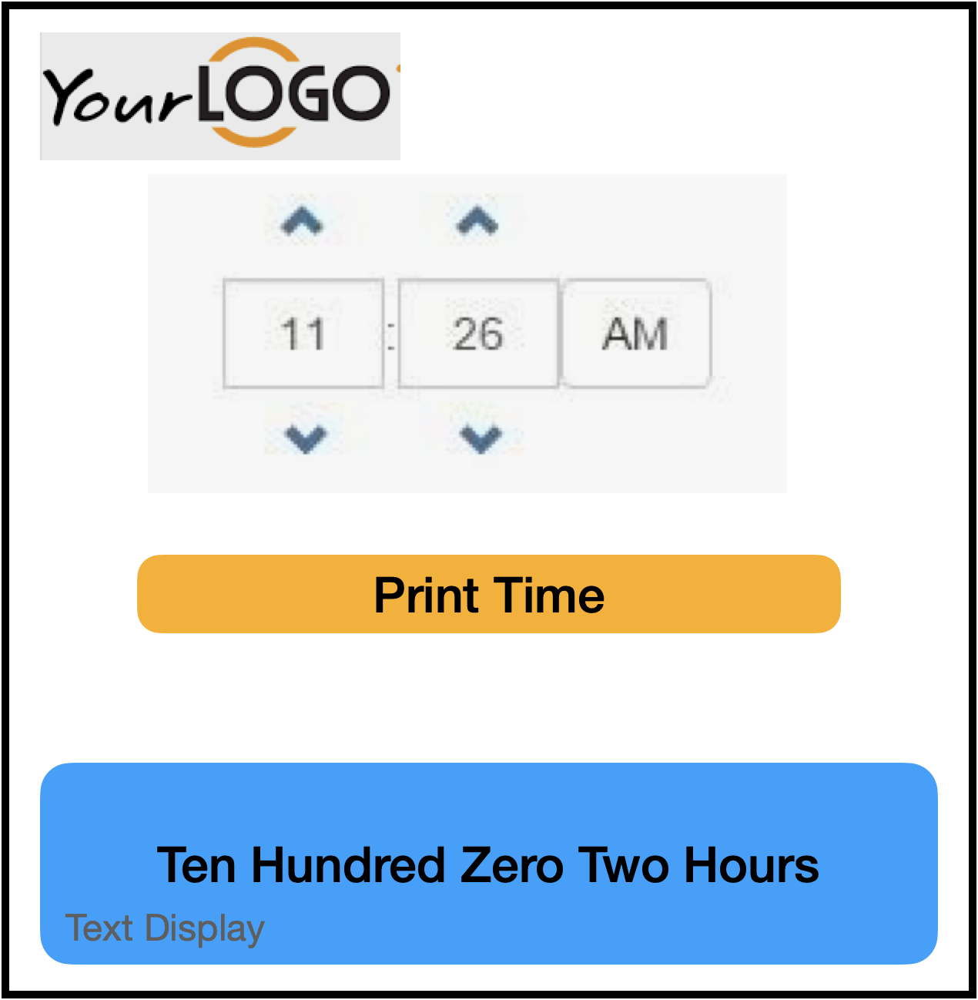

# Typescript

_Hot, Hot, HOT!_

A directive has come down from Vice President Lossie - our organization needs to know more about **TypeScript** because she has heard that several companies will need dozens of people who know the language.

https://www.typescriptlang.org

We have to make a demo to the Board of Directors on Monday at Noon!

You need to build a bootcamp time app; it needs to take in a time and produce a string of that time in English.

VP Lossie has also said that the companies need people with experience in **Visual Studio Code** (because it is written in TypeScript!) SO yo need to download vscode and use it as the IDE on this project!!

https://code.visualstudio.com

Fork this REPO, clone it, and be sure to commit often! Push after every commit! Feel free to use this app **GitHub Desktop** to do all the GIT stuff with!

https://desktop.github.com

Time to see some 21st century tools!

# Problem 6: TypeScript Boot Camp Time

Given a time, given a time from a simple user interface in numerical format, convert that value into its military time phrase and display it on the app.

**Complete in TypeScript**

**Provide Unit Testing**

Example 1 Input

```
1:30pm 
```

Example 1 Output

```
Thirteen Hundred and Thirty Hours
```


Example 2 Input

```
1:30am
```

Example 2 Output 

```
Zero One Hundred and Thirty Hours
```

Example 3 Input 

```
2:22pm
```

Example 3 Output

```
Fourteen Hundred and Twenty Two Hours
```

Example 4 Input

```
2:11am
```

Example 4 Output

```
Zero Two Hundred and Eleven Hours
```

Example 5 Input

```
10:02am
```

Example 5 Output

```
Ten Hundred Zero Two Hours
```

## The App

Build a simple UI using Angular:

A page which has three pieces, 
up top a simple time chooser/picker, where you can only pick 1 - 12 hours, 0 - 59 minutes and Am/Pm.
A button in the middle labelled "Print Time"
and in the lower section, a text field that has the time printed out like the examples above.



This shows a bogus logo, make, steal, copy, whatever a better one. 
This also shows a simple time chooser. 
Use any time chooser that you think is cool.
There are many out there; search a bit.

All this must be done in Typescript, using angular. It is just a "front-end" app; no back end work required.
The app will "run in your browser" and be pretty simple. Extra points with VP Lossie for cool styling, neat UI around time entry
and general tidiness of the app. 

